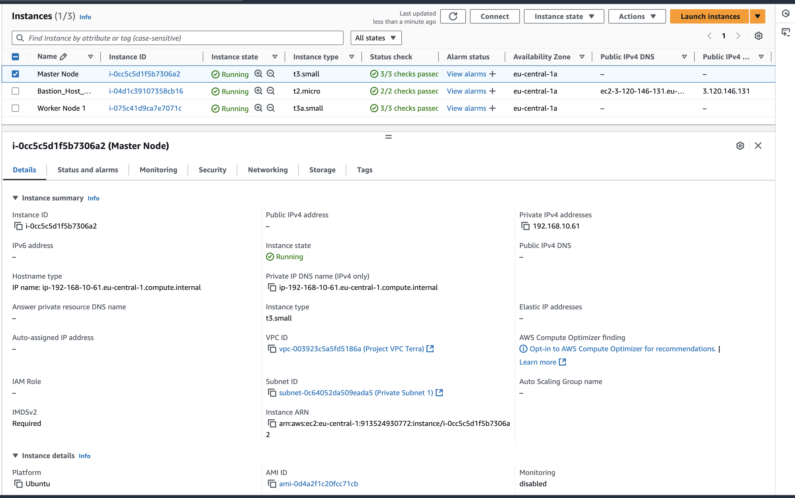
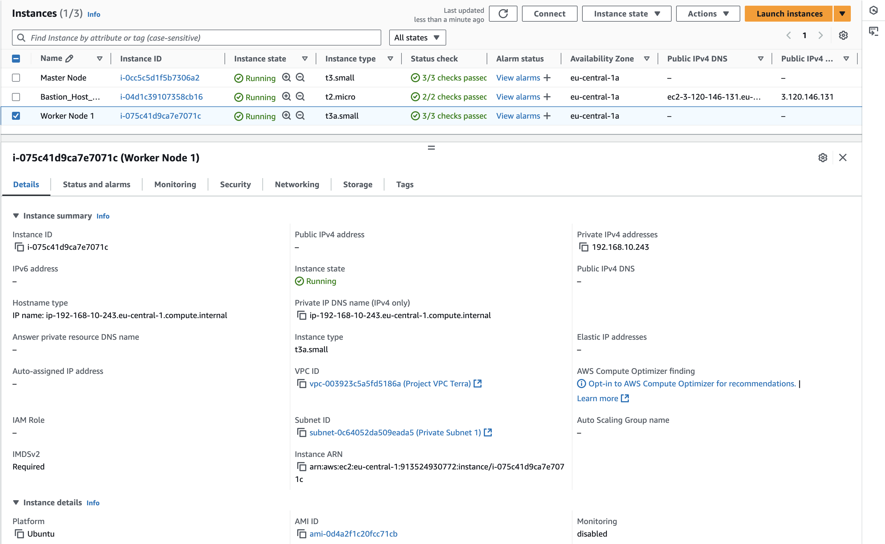
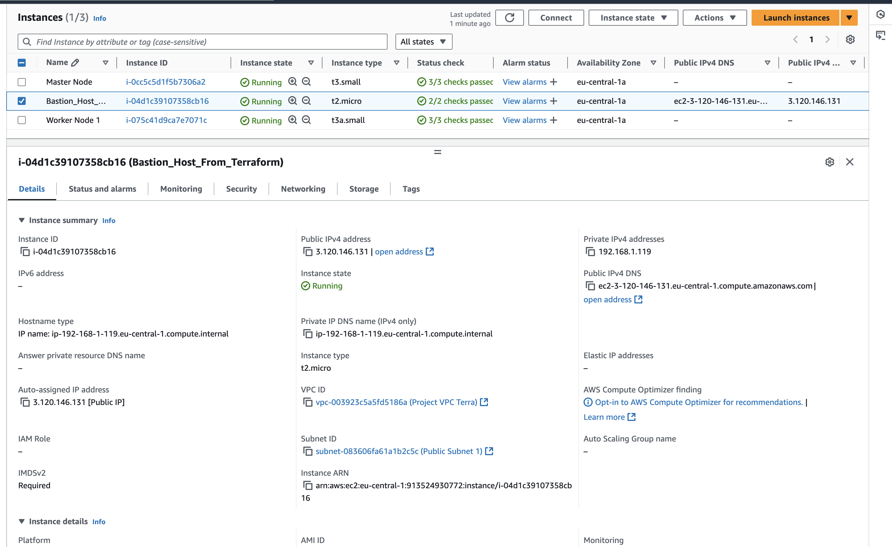
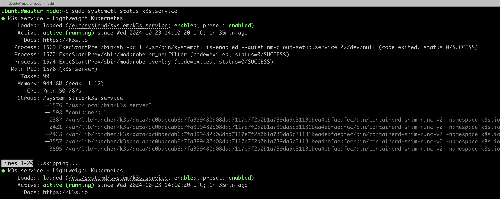
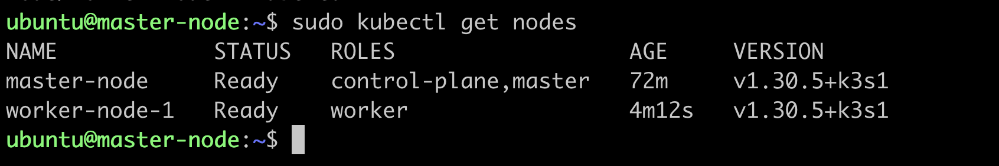
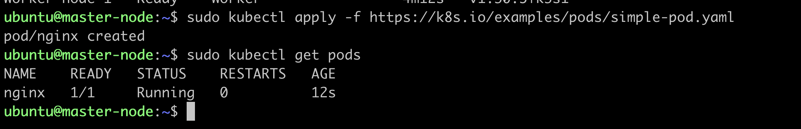

### Project Structure:

```bash
├── README.md
├── images
│   ├── task_2
│   └── task_3
└── terraform
    ├── acl.tf
    ├── ami.tf
    ├── ec2_bastion.tf
    ├── ec2_k3s_master_node.tf
    ├── ec2_k3s_worker_node.tf
    ├── iam - not used in this task
    │   └── iam_oidc_settings.tf
    ├── network - not used in this task
    │   ├── acl.tf
    │   ├── create_ec2.tf
    │   ├── network.tf
    │   ├── security_groups.tf
    │   └── varaiables.tf
    ├── network.tf
    ├── providers.tf
    ├── s3_tfstate - not used in this task
    │   └── s3_tfstate_bucket.tf
    ├── security_groups.tf
    ├── sh
    │   ├── master_node.sh.tpl
    │   └── worker_node.sh.tpl
    └── varaiables.tf

```
-----------------------------------------------

1. **Terraform Code for AWS Resources (10 points)**

   - Terraform code is created or extended to manage AWS resources required for the cluster creation.
   > Created two tf files for creating ec2 instances for master-node [ec2_k3s_master_node.tf](terraform/ec2_k3s_master_node.tf)  and worker-nodes  [ec2_k3s_worker_node.tf](terraform/ec2_k3s_worker_node.tf)

   
   

   - The code includes the creation of a bastion host.

   > File for creation bastion host [ec2_bastion.tf](terraform/ec2_bastion.tf)

   


2. **Cluster Deployment (60 points)**

   - A K8s cluster is deployed using either kOps or k3s.

   - The deployment method is chosen based on the user's preference and understanding of the trade-offs.

     For my project I choose k3s. 

    

3. **Cluster Verification (10 points)**

   - The cluster is verified by running the `kubectl get nodes` command from the local computer.
   
   - A screenshot of the `kubectl get nodes` command output is provided.

    

4. **Workload Deployment (10 points)**

   - A simple workload is deployed on the cluster using `kubectl apply -f https://k8s.io/examples/pods/simple-pod.yaml`.
   - The workload runs successfully on the cluster.

   

5. **Additional Tasks (10 points)**
   - Document the cluster setup and deployment process in a README file.

   For setup cluster use this command 
   > curl -sfL https://get.k3s.io | sh 

   I am using sh scripts for setting master-node EC2 [master_node.sh.tpl](terraform/sh/master_node.sh.tpl) and worker-nodes EC2 [worker_node.sh.tpl](terraform/sh/worker_node.sh.tpl) and setup cluster on master node
   
   After that I am connect to the worker node and add it to my cluster using this command

   > curl -sfL https://get.k3s.io | K3S_URL=https://myserver:6443 K3S_TOKEN=mynodetoken sh -

   Where myserver is a master-node, K3S_TOKEN you can find on master node in this path "/var/lib/rancher/k3s/server/node-token"

   For add role to node use this command

   > sudo kubectl label node your_node_name node-role.kubernetes.io/worker=worker

   Thats enough to create simple cluster.

