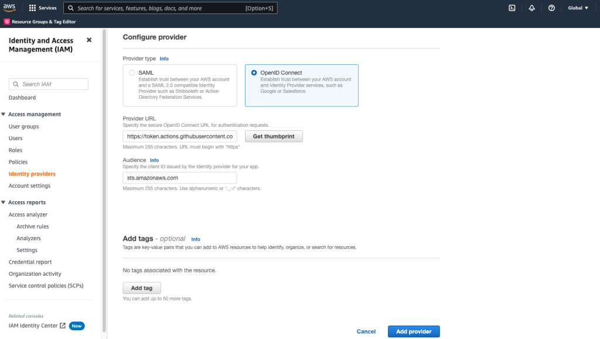

# rsschool-devops-course-tasks

Use IAM roles to connect GitHub Actions to actions in AWS

Step 1: Create an OIDC provider in your account
The first step in this process is to create an OIDC provider which you will use in the trust policy for the IAM role used in this action.

To create an OIDC provider for GitHub (console):
1. Open the IAM console.
2. In the left navigation menu, choose Identity providers.
3. In the Identity providers pane, choose Add provider.
4. For Provider type, choose OpenID Connect.
5. For Provider URL, enter the URL of the GitHub OIDC IdP for this solution: https://token.actions.githubusercontent.com
6. Choose Get thumbprint to verify the server certificate of your IdP. To learn more about OIDC thumbprints, see Obtaining the thumbprint for an OpenID Connect Identity Provider.
7. For Audience, enter sts.amazonaws.com. This will allow the AWS Security Token Service (AWS STS) API to be called by this IdP.
8. (Optional) For Add tags, you can add key–value pairs to help you identify and organize your IdPs. To learn more about tagging IAM OIDC IdPs, see Tagging OpenID Connect (OIDC) IdPs.
9. Verify the information that you entered. Your console should match the screenshot in Figure 1. After verification, choose Add provider.

