### Project Structure:
``` bash
├── README.md
├── images
│   └── task_2
│      
└── terraform
│   ├── acl.tf
│   ├── create_ec2.tf
│   ├── iam_oidc_settings.tf
│   ├── network.tf
│   ├── providers.tf
│   ├── s3_tfstate_bucket.tf
│   ├── security_groups.tf
│   └── varaiables.tf
└── .github/
    └── workflows/
        └── ci_cd.yml
```
----------------------------------


### Terraform Code Implementation (50 points)
> All network configuration keeps here - [network.tf](terraform/network.tf)


Terraform code is created to configure the following:
- VPC
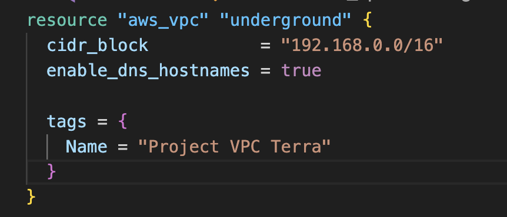

- 2 public subnets in different AZs
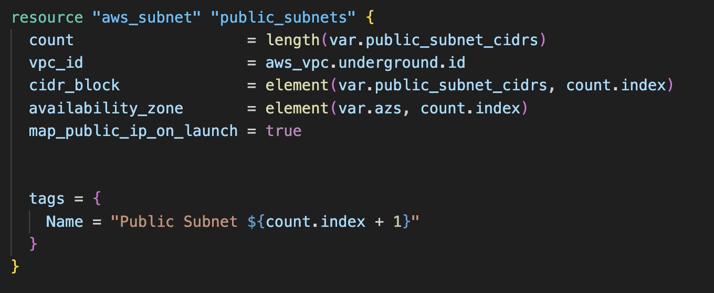

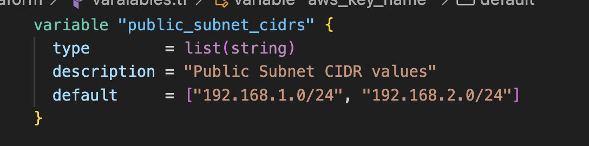

- 2 private subnets in different AZs
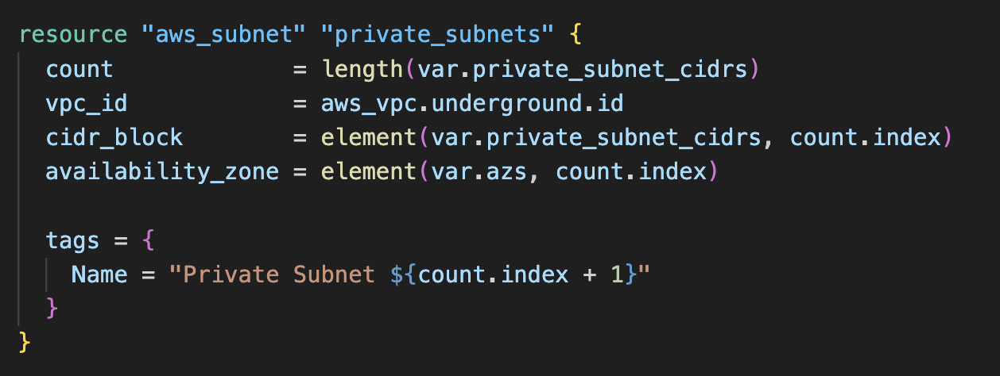

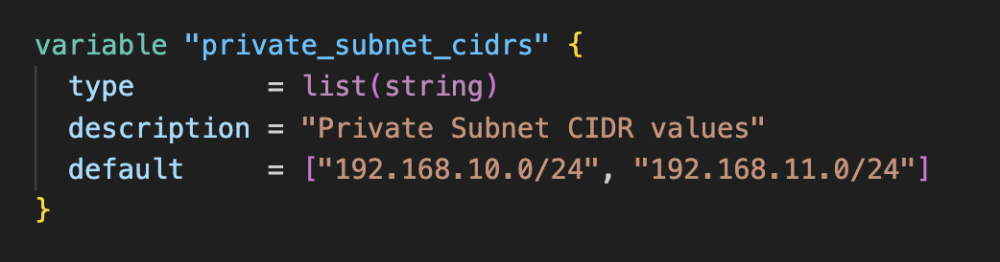


- Internet Gateway
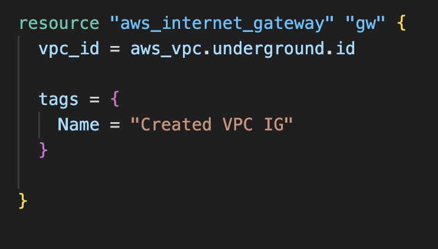

- Routing configuration:

Instances in all subnets can reach each other

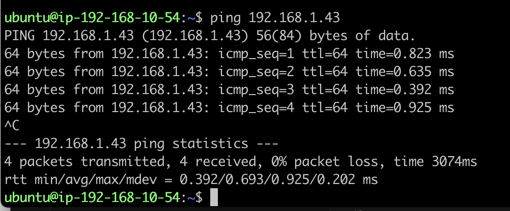

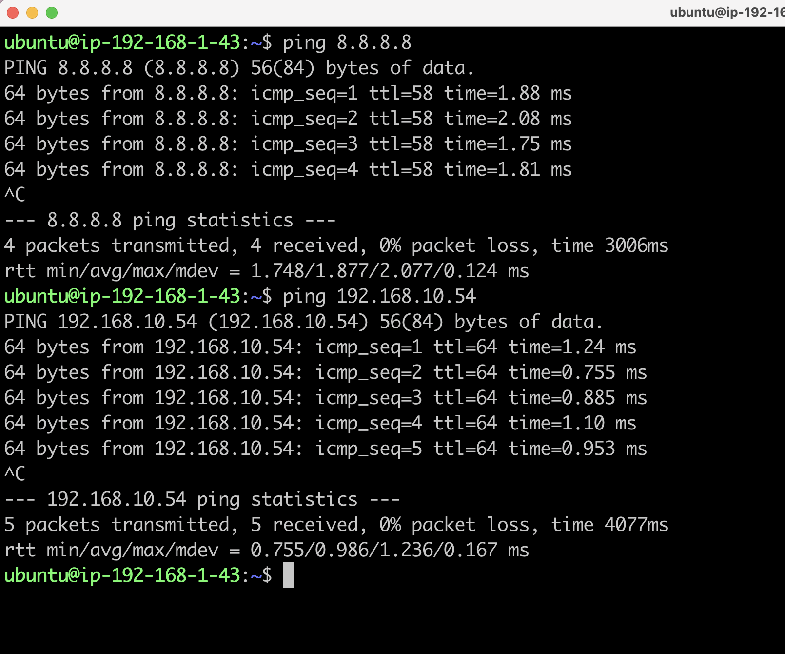

Instances in public subnets can reach addresses outside VPC and vice-versa

Bastion host in a public subnet 
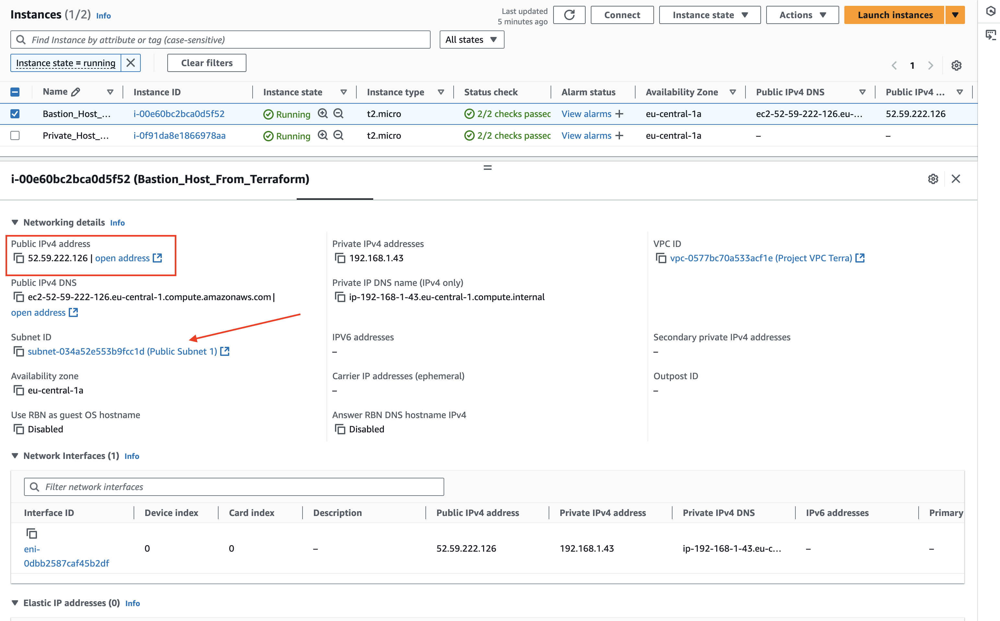

He can reach addresses outside VPC and vise-versa and also all subnets in VPC

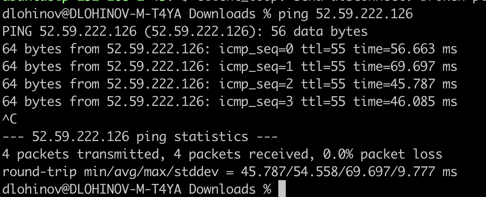


---------------------------
### Code Organization (10 points)

- Variables are defined in a separate variables file.

All vars here - [varaiables.tf](terraform/varaiables.tf)

- Resources are separated into different files for better organization.

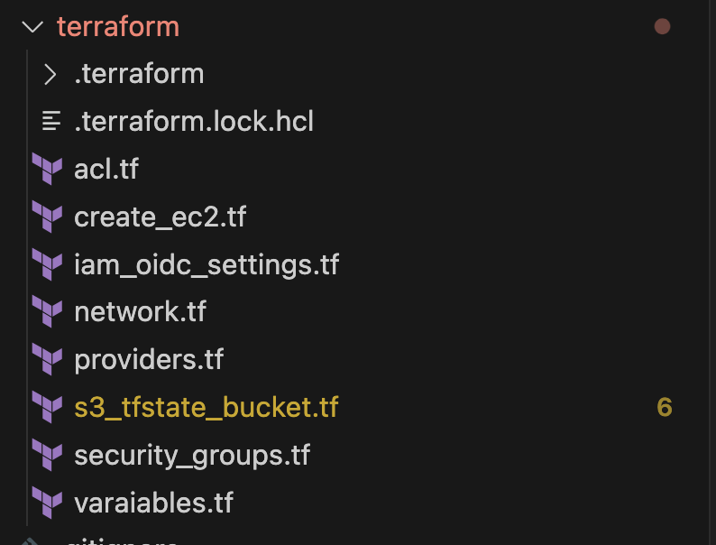

---------------

### Verification (10 points)

- Terraform plan is executed successfully.

> Check github actions - https://github.com/Dema-dev/rsschool-devops-course-tasks/actions

- A resource map screenshot is provided (VPC -> Your VPCs -> your_VPC_name -> Resource map).

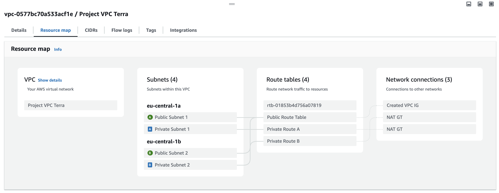

----------------------------------------

### Additional Tasks (30 points)

- Security Groups and Network ACLs (5 points)

Implement security groups and network ACLs for the VPC and subnets.

> Terraform file for Security groups - [security_groups.tf](terraform/security_groups.tf)

> Terraform file for ACLs - [acl.tf](terraform/acl.tf)

- Bastion Host (5 points)
Create a bastion host for secure access to the private subnets.

> Bastion host terraform file - [create_ec2.tf](terraform/create_ec2.tf)


- NAT is implemented for private subnets (10 points)

> NAT settings here - [network.tf](terraform/network.tf)

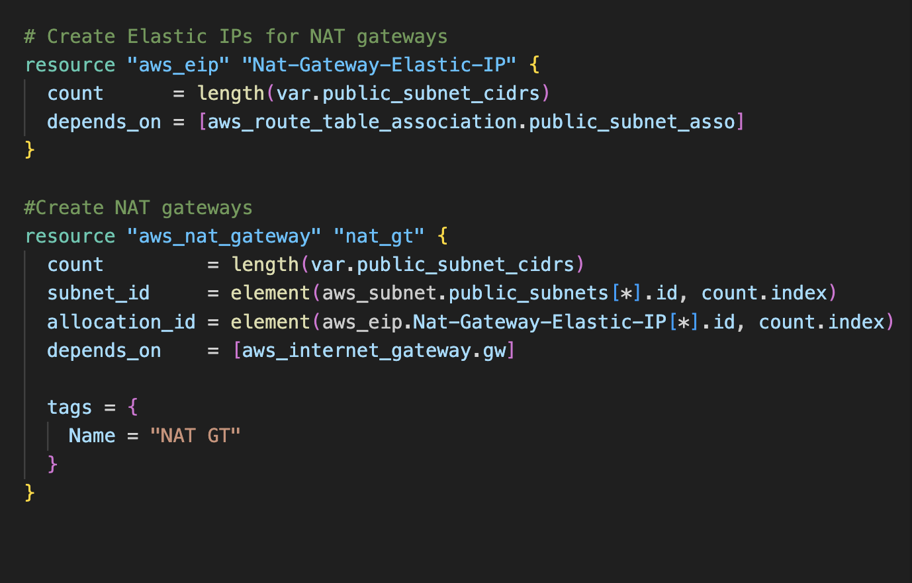

Orginize NAT for private subnets with simpler or cheaper way

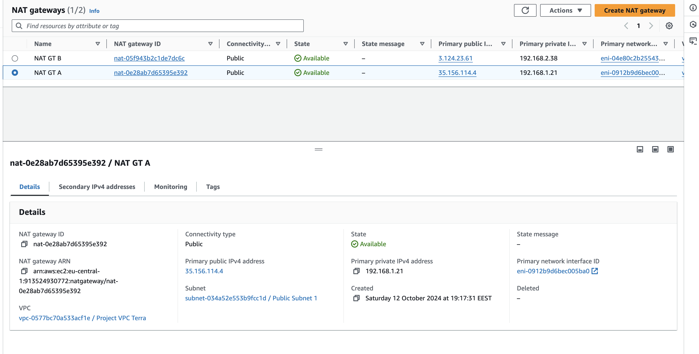 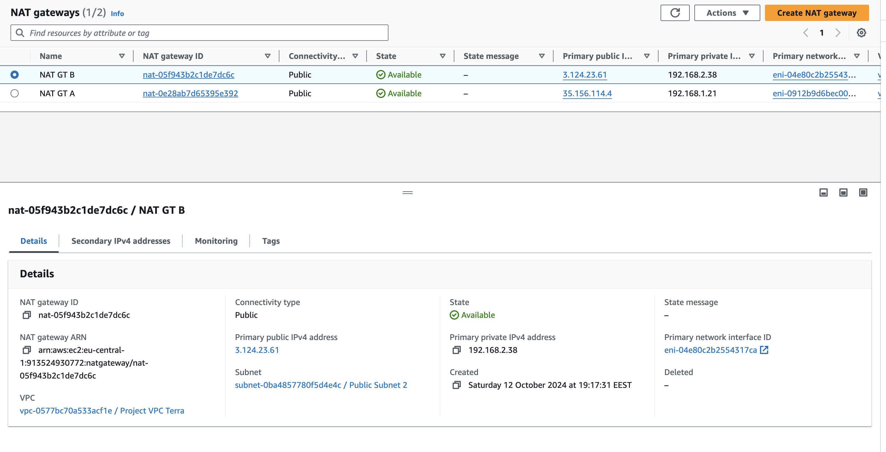

Instances in private subnets should be able to reach addresses outside VPC

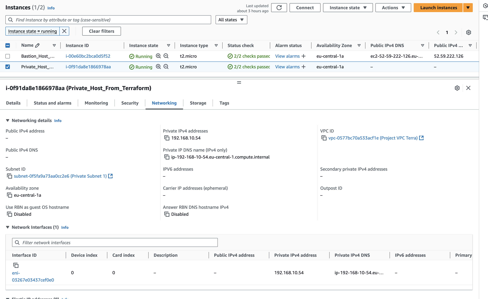

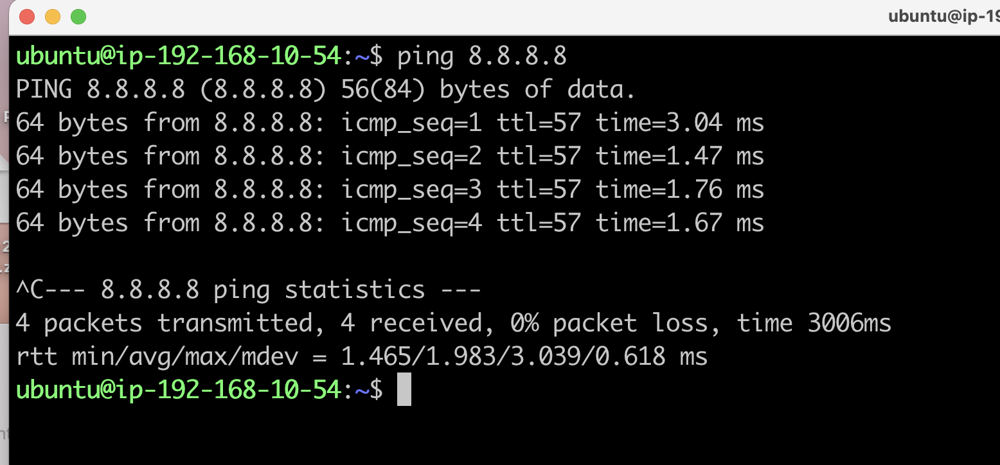

- Documentation (5 points)
Document the infrastructure setup and usage in a README file.

- Submission (5 points)
A GitHub Actions (GHA) pipeline is set up for the Terraform code.

