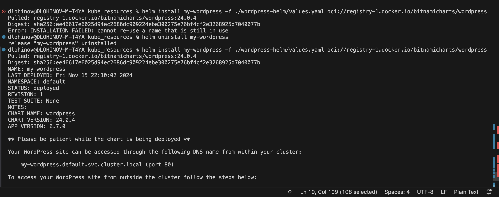
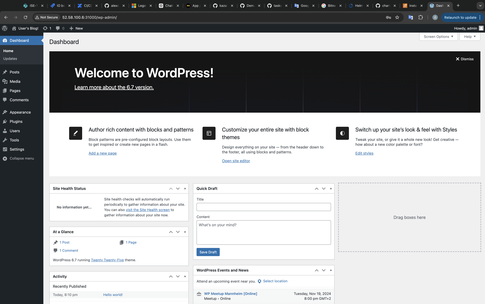
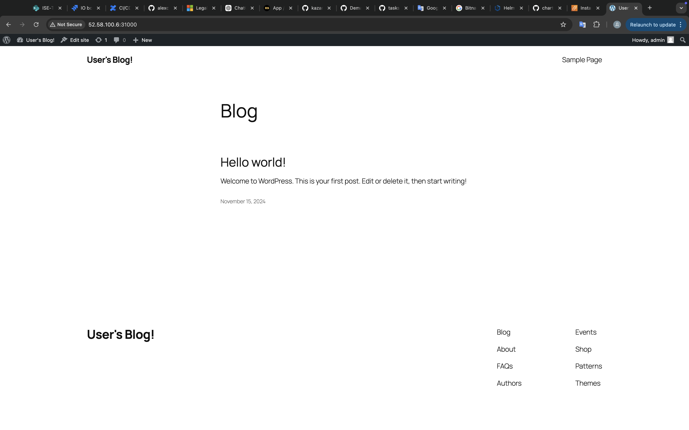

## Evaluation Criteria (100 points for covering all criteria)

1. **Helm Chart Creation (40 points)**

   - A Helm chart for the WordPress application is created.
    
    > Wordpress Helm chart  values here - [values.yaml](kube_resources/wordpress-helm/values.yaml)

    

2. **Application Deployment (30 points)**

   - The application is deployed using the Helm chart.

    

   - The application is accessible from the internet.

    
    

3. **Repository Submission (5 points)**

   - A new repository is created with the WordPress and Helm chart.

   It is created in different branch.

4. **Verification (5 points)**

   - The application is verified to be running and accessible.

   

5. **Additional Tasks (20 points)**
   - **CI/CD Pipeline (10 points)**
     - A CI/CD pipeline is set up to automate the deployment of the application.

    > Automation deploy you can see here - [master_node.sh.tpl](terraform/sh/master_node.sh.tpl)

   - **Documentation (10 points)**
     - The application setup and deployment process are documented in a README file.
