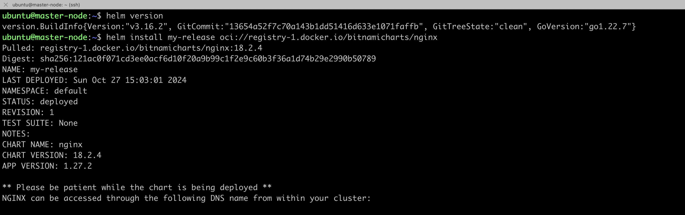
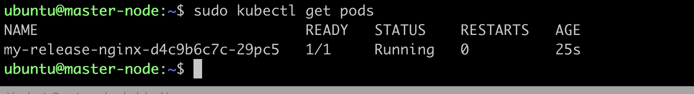
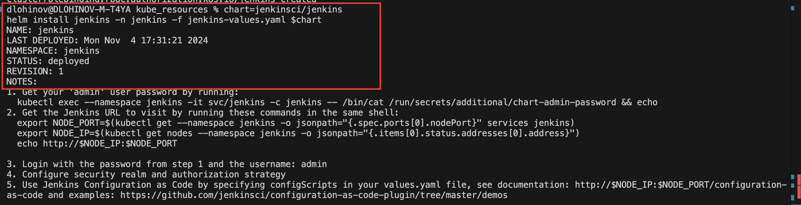
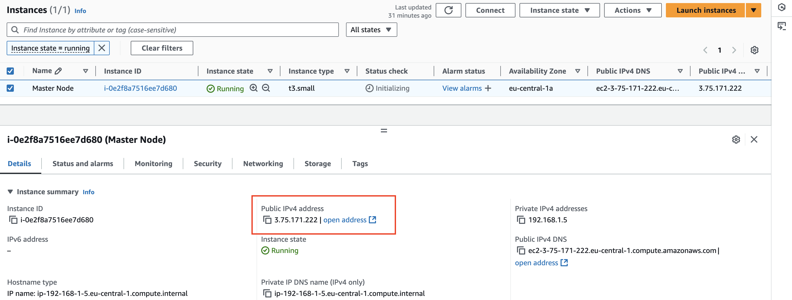
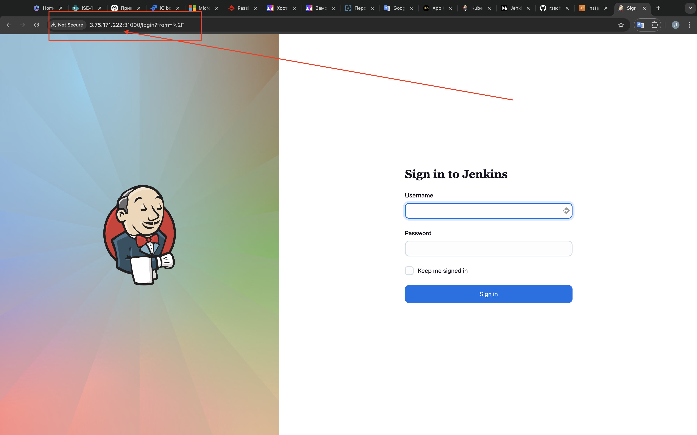
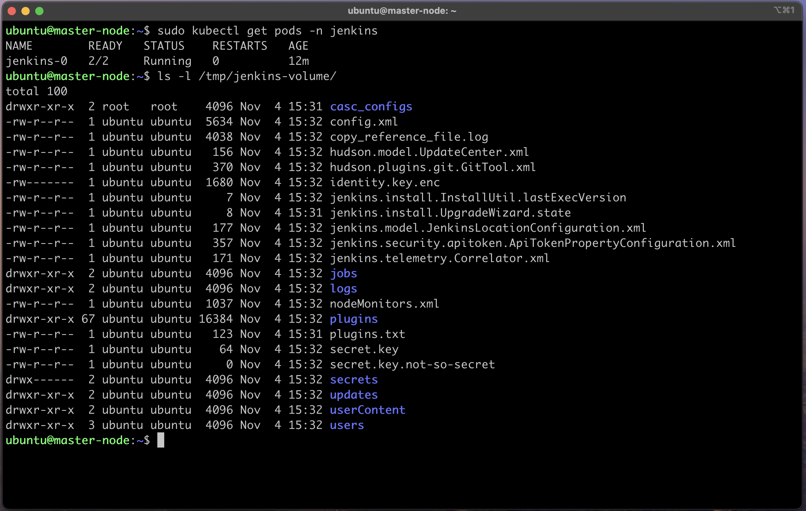
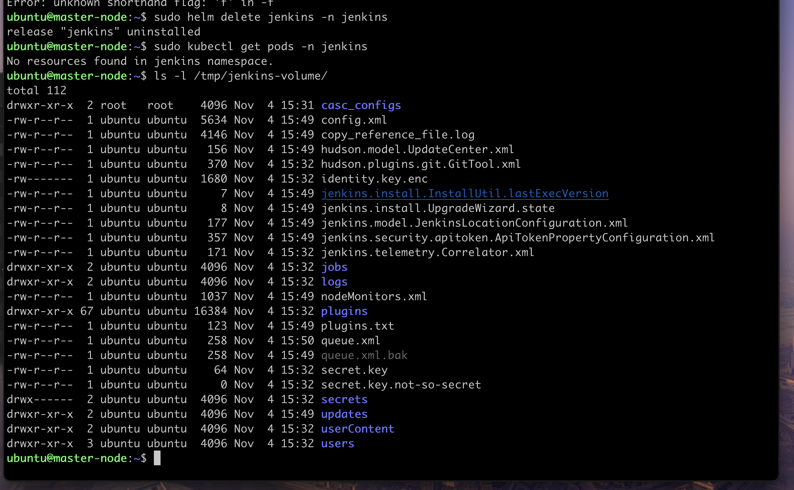
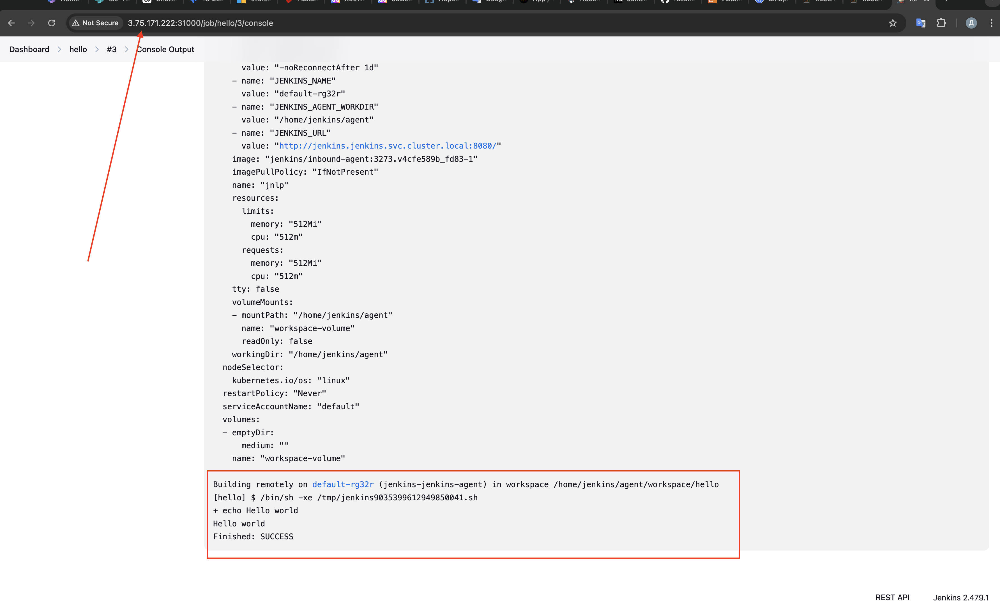

### Project Structure:

```bash

├── README.md
├── images
│   ├── task_2
│   ├── task_3
│   └── task_4
├── kube_resources
│   ├── jenkins-kuber-without-helm - Not used in this task
│   ├── jenkins-sa.yaml
│   ├── jenkins-values.yaml
│   ├── jenkins-volume.yaml
└── terraform
    ├── acl.tf
    ├── ami.tf
    ├── ec2_bastion.tf
    ├── ec2_k3s_master_node.tf
    ├── ec2_k3s_worker_node.tf
    ├── iam - Not used in this task
    ├── network - Not used in this task
    ├── network.tf
    ├── providers.tf
    ├── s3_tfstate - Not used in this task
    ├── security_groups.tf
    ├── sh
    │   ├── master_node.sh.tpl
    │   └── worker_node.sh.tpl
    └── varaiables.tf


```
-----------------------------------------------

## Evaluation Criteria (100 points for covering all criteria)

1. **Helm Installation and Verification (10 points)**

   - Helm is installed and verified by deploying the Nginx chart.
 
   
       

2. **Cluster Requirements (10 points)**

   - The cluster has a solution for managing persistent volumes (PV) and persistent volume claims (PVC).

   > File for creation persisten volume for jenkins service - [jenkins-volume.yaml](kube_resources/jenkins-volume.yaml)

   > This volume claims here - [jenkins-values.yaml](kube_resources/jenkins-values.yaml), line number 1253

3. **Jenkins Installation (50 points)**

   - Jenkins is installed using Helm in a separate namespace.
    
    

   - Jenkins is available from the internet.

   
   

4. **Jenkins Configuration (10 points)**

   - Jenkins configuration is stored on a persistent volume and is not lost when Jenkins' pod is terminated.

    > Before delete
   

   > After delete
   

5. **Verification (10 points)**

   - A simple Jenkins freestyle project is created and runs successfully, writing "Hello world" into the log.

   

6. **Additional Tasks (10 points)**
   - **GitHub Actions (GHA) Pipeline (5 points)**
     - A GHA pipeline is set up to deploy Jenkins.
   - **Authentication and Security (5 points)**
     - Authentication and security settings are configured for Jenkins.